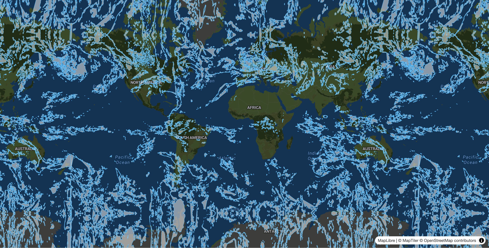

# Try live
## <https://clouds.heymoon.cc>

# About
Live vector cloud map based on live data provided by <https://eumetsat.int>



# Navigation
* Supports mouse (for Desktop: drag with left button to move, right button to pan, scroll to zoom) and touch gestures (simmilar to Google Maps for smartphones or tablets)
* Use browser's «back» and «forward» navigation buttons to browse camera movement history with smooth transition between previous locations
* Share your observation spots across your devices and with other people: just copy full URL of the current map's page to include your camera's position as initial spot. Example links for places:
    * [Sky over Sydney](https://clouds.heymoon.cc/#151.21;-33.86;10;0;45;0)
    * [Sky over Tokyo](https://clouds.heymoon.cc/#139.778;35.68;10;0;45;0)
    * [Sky over Moscow](https://clouds.heymoon.cc/#37.62;55.75;10;0;45;0)

# Environment variables
* **SOURCE_WIDTH** - `4096`(default)/`2048`/`1024`
* **SOURCE_HEIGHT** - `2048`(default)/`1024`/`512`

# Stack
* [heymoon/vector-tile-data-provider](https://packagist.org/packages/heymoon/vector-tile-data-provider)
* [Symfony 7](https://symfony.com/7)
* [libgeos](https://libgeos.org)
* [imagemagick](https://imagemagick.org)
* [MapLibre GL](https://maplibre.org)
* [Redis](https://redis.io)

# Wallpaper mode
If your desktop environment allows to use web page as a background (for example in KDE using [HTML Wallpaper](https://store.kde.org/p/1324580) plugin), you can add query parameter `?wallpaper=1` to your URL to hide time controls and launch animation immediately. Example:

<https://clouds.heymoon.cc/?wallpaper=1#132.16369401846373;0.282109199965177;3.9276030513952844;0;0;0>
---


# Local storage settings

Following settings can be redefined via browser's `localStorage` for testing purposes:

* **debug** - write camera positions to dev console when changed
    * Default: `false`
* **style** - overwrite style source URL
    * Default: `/style`
* **initial** - overwrite initial position. Compatible with objects logged with debug flag.
    * Example usage: ```localStorage.setItem('initial', JSON.stringify({lng: 136.272, lat: -25.145, zoom: 3.3236095600755164, bearing: 0, pitch: 0, roll: 0, zoom: 3}))```
    * Default: `{"lng":37.618423,"lat":55.751244,"zoom":3,"bearing":180,"pitch":60,"roll":0}`
* **animationSpeed** - interval between changes
    * Default: `110`
* **animationStart** - delay before animation start. If time slider is left on the earliest value for more milliseconds than defined here, it will start to replay current day in the loop. Alternatively, animation will start from initial position after this period multiplied by 3
    * Default: `5000`

# Troubleshooting

## JS build on Mac OS

`node:25-alpine` stage is known to produce invalid results in production mode for `maplibre-js` (as well as `mapbox-js`) when platform `linux/amd64` is emulated using official Docker engine for Mac OS. It will complete without errors but resulting JS-bundle will be broken.

Use Linux or install `Node 25` on your host and build static manually with `make static` (you'll need to modify Dockefile yourself for this workaround). Development build doesn't have this issue.
