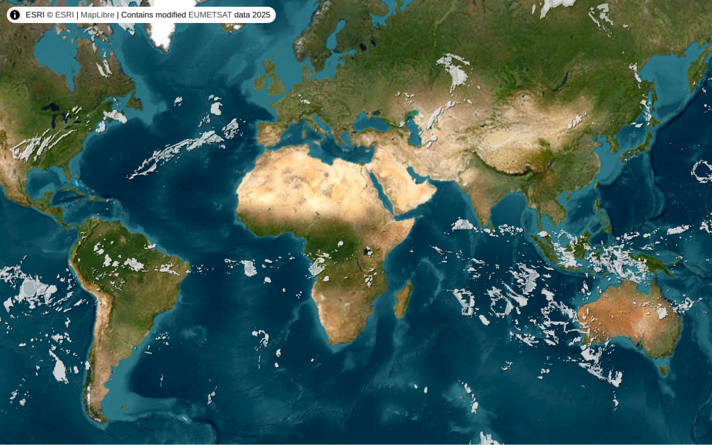

# About
Live vector cloud map based on [matteason/live-cloud-maps](https://github.com/matteason/live-cloud-maps)

### <https://clouds.heymoon.cc>

# Environment variables
* **MAP_TILER_TOKEN** - token from [MapTiler Cloud](https://cloud.maptiler.com/account/keys/) (for base layer)
* **SOURCE_WIDTH** - `8192`/`4096`/`2048`/`1024`
* **SOURCE_HEIGHT** - `4096`/`2048`/`1024`/`512`

# Stack
* [heymoon/vector-tile-data-provider](https://packagist.org/packages/heymoon/vector-tile-data-provider)
* [Symfony 7](https://symfony.com/7)
* [libgeos](https://libgeos.org)
* [imagemagick](https://imagemagick.org)
* [MapLibre GL](https://maplibre.org)
* [MapTiler](https://www.maptiler.com)
* [Redis](https://redis.io)
